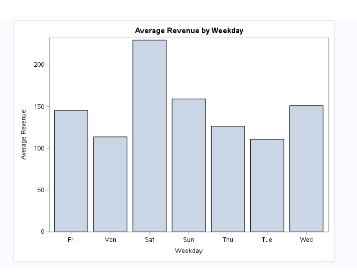
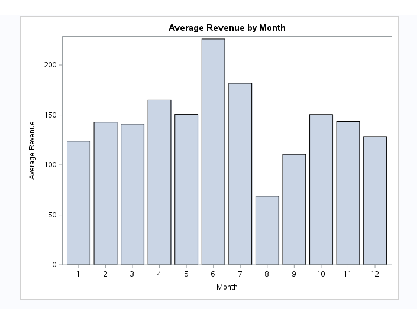
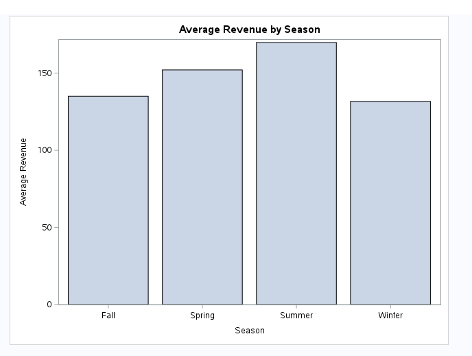
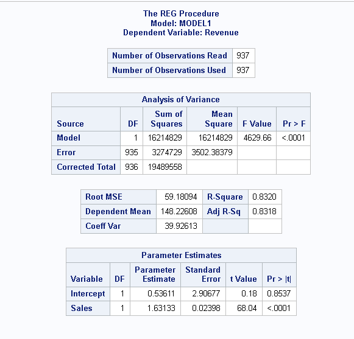
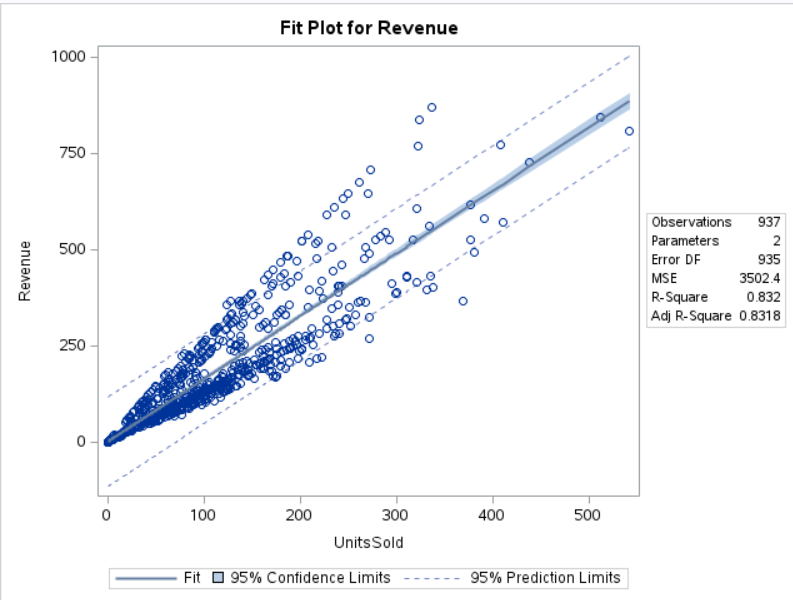
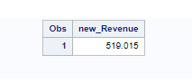

# Data-Analytics-using-SAS

   The goal is to develop a predictive model that estimates the sales revenue of a retail store based on various factors using information from a dataset on kaggle, which will be provided in the link below. The csv file can also be found in the files folder on this repository.
   https://www.kaggle.com/datasets/tevecsystems/retail-sales-forecasting/data
   
### Approach to the Analysis

   1. **Loading the data into SAS Studio**
   2. **Cleaning the data.**
   3. **Data Visualization and Analysis**
   4. **Prediction by Linear Regression**

### SAS Studio Code
```sas
libname mydata '/home/u639XXXXX/Project';

/* 1. Load data into SAS and convert csv file */
proc import datafile='/home/u639XXXXX/Project/mock_kaggle.csv'
 	out=work.kaggle
	dbms=csv
	replace; 
	(column names)  getnames=yes; 
run; 

/* 2. Rename columns of the table */
data kaggle;
	set kaggle;
	rename data = Date
		   venda = UnitsSold
		   estoque = Stock
		   preco = Price;
run;

/* 3. create new column to calculate revenue */
data work.kaggle;
	set kaggle;
	Revenue = UnitsSold * Price;
run;

/* 4. Convert dates in a column into months. */
data work.kaggle;
	set kaggle;
	Month = put(Date,monname3.);
run;

/*5. Identify which dates in a column correspond to which weekdays. This will help in our explatory data analysis */
data work.kaggle;
	set kaggle;
	Day_of_Week = put(Date, downame3.);
run;

/*6. We then assign seasons to the corresponding months. Taking the Northern Hemisphere Approach. */
data work.kaggle;
	set kaggle;
	Month = month(Date); /* This extracts the month from the date given */
	
	/* Using if statements, we assign seasons based on the months. */
	if Month in (12, 1, 2) then Season = 'Winter';
	else if Month in (3, 4, 5) then Season = 'Spring';
	else if Month in (6, 7, 8) then Season = 'Summer';
	else if Month in (9, 10, 11) then Season = 'Fall';
run;

/*6. Calculate the Average Revenue by Weekday*/
proc means data= kaggle;
	class Day_of_Week;
	var Revenue;
run;
```
### Average Revenue by Weekday Histogram 

```sas 
/*Plot a histogram based on the Average Revenue by Weekday*/
proc sgplot data= kaggle;
	title Average Revenue by Weekday;
	vbar Day_of_Week / response=Revenue stat=mean;
	xaxis label = 'Weekday';
	yaxis label = 'Average Revenue';
run;
title;
```
### Results


### Average Revenue by Month and Season Histograms
```sas
/*Calculate the Average Revenue by Month*/
proc means data= kaggle;
	class Month;
	var Revenue;
run;
/* Plot a histogram based on the Average Revenue by Month*/
proc sgplot data= kaggle;
	title Average Revenue by Month;
	vbar Month / response=Revenue stat=mean;
	xaxis label = 'Month';
	yaxis label = 'Average Revenue';
run;
title;
/*Calculate the Average Revenue by Season*/
proc means data= kaggle;
	class Season;
	var Revenue;
run;
/* Plot a histogram based on the Average Revenue by Season*/
proc sgplot data= kaggle;
	title Average Revenue by Season;
	vbar Season / response=Revenue stat=mean;
	xaxis label = 'Season';
	yaxis label = 'Average Revenue';
run;
title;
```

### Results



### Interpretation

The histogram for Average Revenue by Month shows that the 6th month (june) had the highest average revenue compared to the other months. The historgram for Avg Rev by Season also backs up this fact with summer having the highest average revenue.

# Pearson Correlation
In short, Pearson Correlation is a stats measure that looks at how strong of a linear relationship two variables have, X and Y. Both X and Y must be continuous variables meaning that they can take on an infinite number of values. Examples of continuous values include but not limited to distance, weight, income, etc.

## Task Scenario
In this project, we have to evaluate the relationship between Revenue and Units Sold. Using the kaggle dataset, we will determine if there is a significant linear relationship between the two variables.

## How?

1. **Calculate the Pearson Correlation:** To measure the strength of the linear relationship between our two variables.

2. **Interpret our results:** Is the relationship significant? What are the implications?

### SAS Code for Pearson Correlation

```sas
proc corr data=kaggle;
    var Revenue UnitsSold;
    title "Pearson Correlation Between Revenue and Units Sold";
run;
```

### Results


## Interpretation

### Simple Statistics
- **N:** The number of observations is 937 for both revenue and units sold.
- **Mean:** The avg revenue is 148.22608 and units sold is 90.53362.
- **Std Dev:** Revenue (144.29892) and Units Sold (80.68209), indicates the spread of the data
- **Minimum:** The smallest observed values for revenue and price were 0
- **Maximum:** The largest observed values for revenue is (870.24000) and Units Sold (542.00000)

### Pearson Correlation Coefficients
- **Pearson Correlation Coefficient (0.91213):** This suggests a strong positive linear relationship between revenue and units sold.

### Statistical Significance
- **Prob > |r| under H0: Rho= 0:** this describes the p-values associated with the correlation coefficients
- For revenue and units sold, the p-value is <.0001 indicating the correlation is statistically significant. 
- A p-value less than 0.05 shows strong evidence against the null hypothesis. So here, we reject the null hypothesis.


### Summary
There is a strong positive correlation between revenue and units sold meaning that as units sold increases, revenue tends to increase as well. Also, the correlation is significant indicating that this relationship is unlikely due to chance. 
#

# Simple Linear Regression on Kaggle Dataset

Simple Linear Regression is used to model the relationship between two variables, one independent and the other dependent. In this project, our independent variable is Units Sold and our dependent is Revenue.

### SAS Code for Linear Regression

```sas
proc reg data=kaggle;
	model Revenue = UnitsSold;
	title "Simple Linear Regression for Revenue based on Units Sold";
run;
title;
```

### Results



## Interpretation of Results

| Term           | Description                                                                                 |
|----------------|---------------------------------------------------------------------------------------------|
| **Intercept**  | The expected value of the dependent variable (Revenue) when the independent variable (Units Sold) is zero. |
| **Slope**      | The change in the dependent variable (Revenue) for a one-unit change in the independent variable (Units Sold). |
| **R-Square**   | Proportion of variance in the dependent variable that can be explained by the independent variable. |
| **p-value**    | Indicates if the regression coefficients are significantly different from zero.             |
| **Standard Error** | Measures the accuracy of the regression coefficients.                                     |

- **Intercept (0.53611)**: When the Price is zero, the expected Revenue increases by $0.53611.
- **Slope (1.63133)**: For every additional $1 increase, the Revenue is expected to increase by $1.63133.
- **R-Square (0.8320)**: Approximately 83.20% of the variability in Revenue can be explained by Units Sold. 
- **p-value (<.0001)**: Indicates that the relationship between Revenue and Units Sold is statistically significant.

### Fit Plot for Revenue



- **Scatter Plot and Fit Line:** The scatter plot shows individual data points of revenue against units sold. 
- **Confidence and Prediction intervals:** The shaded area represents the 95% confidence level. The dashed lines indicated the 95% prediction interval.
- **Observations and Parameters:** 937 observations, 2 parameters (intercept and slope)

**Interpretations**

Where the data is concentrated shows that our units sold mostly range from 100 to 200 units. As the data spreads out we see fewer points where units sold surpassed 200 units. This could suggest that those products were either less popular or more likely at a higher cost on average. It would explain why our revenue still remains high even though fewere of those products were sold.

### Predicting Revenue 

Next, we will use this model to predict the revenue when given expected units sold.

```sas
data new_data;
    input UnitsSold;
    datalines;
5000
;
run;

proc reg data=kaggle outest=est;
    model Revenue = UnitsSold;
run;

data prediction;
    set est;
    new_Revenue = Intercept + 1.63133 * 5000;
run;

proc print data=prediction;
    var new_Revenue;
run;
```
## Calculation and Results

Given our **intercept (0.53611)** and **slope (1.63133)**, the predicted revenue for **5000 units sold** is calculated:

$$
new\_Revenue = 0.53611 + 1.63133 * 5000 = 8157.19
$$


And we are supported by the results from our Model



### Conclusion

The Simple Linear Regression on the kaggle dataset shows a strongly significant positive relationship between Revenue and Units Sold.

### Further Considerations

