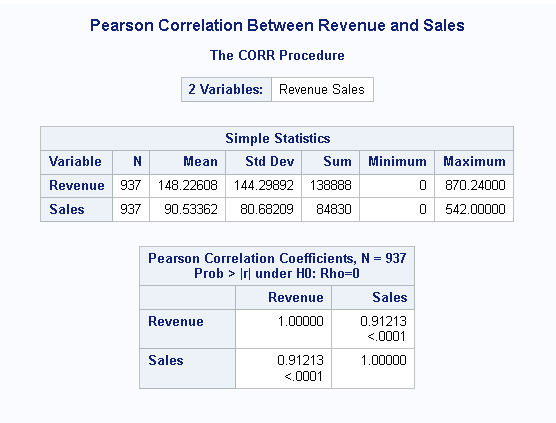

# Data-Analytics-using-SAS

   The goal is to develop a predictive model that estimates the sales revenue of a retail store based on various factors using information from a dataset on kaggle, which will be provided in the link below. The csv file can also be found in the files folder on this repository.
   https://www.kaggle.com/datasets/tevecsystems/retail-sales-forecasting/data
   
### Approach to the Analysis

   1. **Loading the data into SAS Studio**
   2. **Cleaning the data.**
   3. **Data Visualization and Analysis**
   4. **Prediction by Linear Regression**

### SAS Studio Code
```sas
libname mydata '/home/u639XXXXX/Project';

/* 1. Load data into SAS and convert csv file */
proc import datafile='/home/u639XXXXX/Project/mock_kaggle.csv'
 	out=work.kaggle
	dbms=csv
	replace; 
	(column names)  getnames=yes; 
run; 

/* 2. Rename columns of the table */
data kaggle;
	set kaggle;
	rename data = Date
		   venda = Sales
		   estoque = Stock
		   preco = Price;
run;

/* 3. create new column to calculate revenue */
data work.kaggle;
	set kaggle;
	Revenue = Sales * Price;
run;

/* 4. Convert dates in a column into months. */
data work.kaggle;
	set kaggle;
	Month = put(Date,monname3.);
run;

/*5. Identify which dates in a column correspond to which weekdays. This will help in our explatory data analysis */
data work.kaggle;
	set kaggle;
	Day_of_Week = put(Date, downame3.);
run;

/*6. We then assign seasons to the corresponding months. Taking the Northern Hemisphere Approach. */
data work.kaggle;
	set kaggle;
	Month = month(Date); /* This extracts the month from the date given */
	
	/* Using if statements, we assign seasons based on the months. */
	if Month in (12, 1, 2) then Season = 'Winter';
	else if Month in (3, 4, 5) then Season = 'Spring';
	else if Month in (6, 7, 8) then Season = 'Summer';
	else if Month in (9, 10, 11) then Season = 'Fall';
run;

/*6. Calculate the Average Revenue by Weekday*/
proc means data= kaggle;
	class Day_of_Week;
	var Revenue;
run;
```
### Average Revenue by Weekday Histogram 

```sas 
/*Plot a histogram based on the Average Revenue by Weekday*/
proc sgplot data= kaggle;
	title Average Revenue by Weekday;
	vbar Day_of_Week / response=Revenue stat=mean;
	xaxis label = 'Weekday';
	yaxis label = 'Average Revenue';
run;
title;
```
### Results


### Average Revenue by Month and Season Histograms
```sas
/*Calculate the Average Revenue by Month*/
proc means data= kaggle;
	class Month;
	var Revenue;
run;
/* Plot a histogram based on the Average Revenue by Month*/
proc sgplot data= kaggle;
	title Average Revenue by Month;
	vbar Month / response=Revenue stat=mean;
	xaxis label = 'Month';
	yaxis label = 'Average Revenue';
run;
title;
/*Calculate the Average Revenue by Season*/
proc means data= kaggle;
	class Season;
	var Revenue;
run;
/* Plot a histogram based on the Average Revenue by Season*/
proc sgplot data= kaggle;
	title Average Revenue by Season;
	vbar Season / response=Revenue stat=mean;
	xaxis label = 'Season';
	yaxis label = 'Average Revenue';
run;
title;
```

### Results


### Interpretation

The histogram for Average Revenue by Month shows that the 6th month (june) had the highest average revenue compared to the other months. The historgram for Avg Rev by Season also backs up this fact with summer having the highest average revenue.

# Pearson Correlation
In short, Pearson Correlation is a stats measure that looks at how strong of a linear relationship two variables have, X and Y. Both X and Y must be continuous variables meaning that they can take on an infinite number of values. Examples of continuous values include but not limited to distance, weight, income, etc.

## Task Scenario
In this project, we have to evaluate the relationship between Revenue and Price. Using the kaggle dataset, we will determine if there is a significant linear relationship between Revenue and Price.

## How?

1. **Calculate the Pearson Correlation:** To measure the strength of the linear relationship between our two variables.

2. **Interpret our results:** Is the relationship significant? What are the implications?

### SAS Code for Pearson Correlation

```sas
proc corr data=kaggle;
    var Revenue Price;
    title "Pearson Correlation Between Revenue and Price";
run;
```

### Results


## Interpretation

### Simple Statistics
- **N:** The number of observations is 937 for both revenue and price
- **Mean:** The avg revenue is 148.22068 and price is 1.59257
- **Std Dev:** Revenue (144.29892) and Price (0.52850), indicates the spread of the data
- **Minimum:** The smallest observed values for revenue and price were 0
- **Maximum:** The largest observed values for revenue is (870.24000) and price (2.98000)

### Pearson Correlation Coefficients
- **Pearson Correlation Coefficient (0.39931):** This suggests a moderate positive linear relationship between revenue and price.

### Statistical Significance
- **Prob > |r| under H0: Rho= 0:** this describes the p-values associated with the correlation coefficients
- For revenue and price, the p-value is <.0001 indicating the correlation is statistically significant. 
- A p-value less than 0.05 shows strong evidence against the null hypothesis. So here, we reject the null hypothesis.


### Summary
There is a moderate positive correlation between revenue and price meaning that as price increases, revenue tends to increase as well. Also, the correlation is significant indicating that this relationship is unlikely due to chance. 
#
### SAS Code for Linear Regression

```sas
proc reg data=kaggle;
	model Revenue = Price;
	title "Simple Linear Regression for Revenue based on Price";
run;
title;
```

### Results


